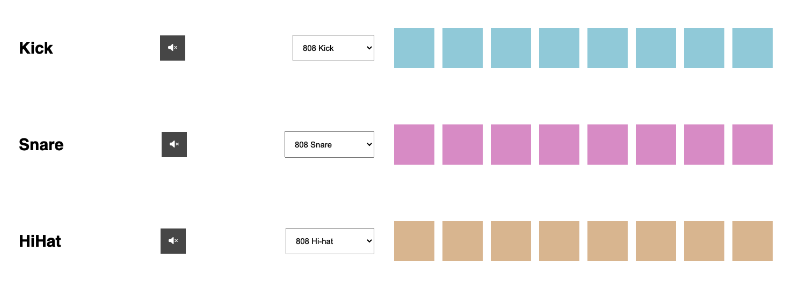

# beatmaker
A simple beatmaker made with HTML, CSS and JavaScript.
This is the result of a tutorial from [Dev Ed](https://www.youtube.com/channel/UClb90NQQcskPUGDIXsQEz5Q) on YouTube.

## How to use

1. Choose a sound
2. Click on the pads to select the position of the sound
3. Press the play button to start the beat and choose the tempo

## Screenshot

## Deployment

https://aloosli.github.io/beatmaker/